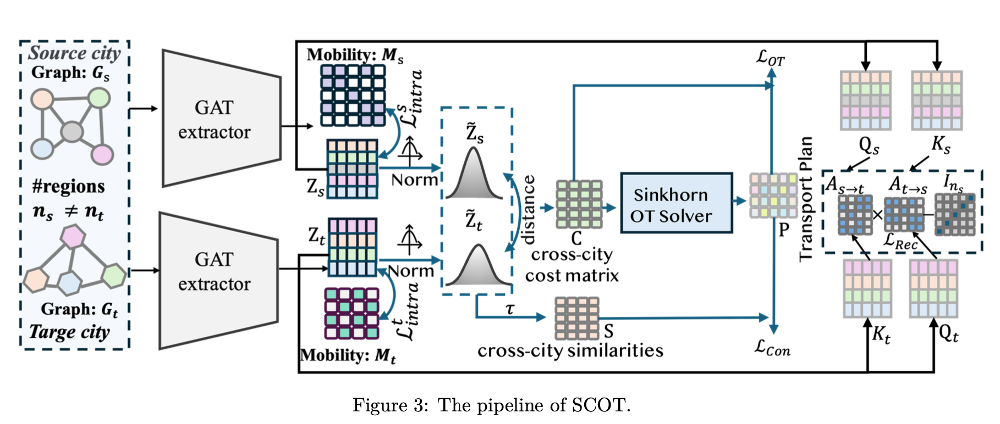
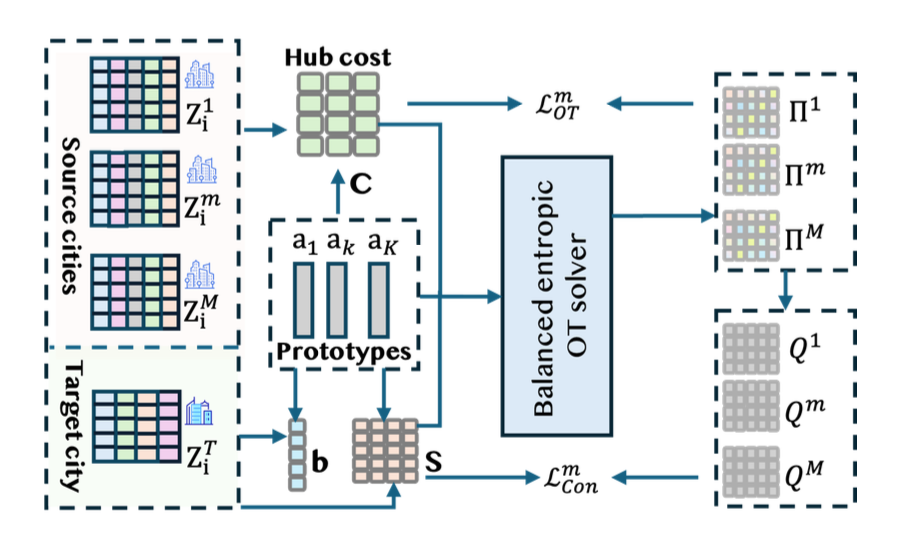

<div align="center">


<br/><br/>

# 🗺️ SCOT

### **Multi-Source Cross-City Transfer with**
### **Optimal-Transport Soft-Correspondence Objectives**

<br/>

*Yuyao Wang · Min Yang · Meng Chen · Weiming Huang · Yongshun Gong*

*Boston University · Shandong University · University of Leeds*

<br/>

[](https://arxiv.org)
[](#)
[](#)

</div>


## 🔍 Overview

Cross-city transfer improves prediction in **label-scarce cities** (e.g., GDP, population, CO₂) by leveraging labeled data from other cities — but cities rarely share compatible region partitions and ground-truth correspondences.

**SCOT** solves this via **explicit soft correspondences** learned through Sinkhorn-based entropic optimal transport, without requiring any one-to-one node matching.

<br/>

<div align="center">

| Problem | SCOT's Answer |
|:---|:---|
| Unequal region counts ($n_s \neq n_t$) | Sinkhorn OT coupling $\mathbf{P} \in \mathbb{R}^{n_s \times n_t}$ |
| No ground-truth region matching | Soft many-to-many correspondences |
| Over-mixing under heterogeneity | OT-weighted contrastive alignment |
| Multi-source gradient conflicts | Shared semantic hub + target-induced prior |

</div>

<br/>

<div align="center">

<br/><sub><b>Figure 1:</b> SCOT pipeline — GAT encoders produce region embeddings, Sinkhorn OT computes soft correspondences P, and the OT-weighted contrastive loss sharpens semantic alignment.</sub>
</div>


## ✨ Key Features

```
📦 SCOT
 ├── 🔗  Entropic OT (Sinkhorn) soft correspondence P between unequal region sets
 ├── 🎯  OT-weighted contrastive (InfoNCE-style) alignment loss
 ├── 🔄  Cycle-style reconstruction regularization for training stability
 ├── 🌐  Multi-source hub prototypes (K) for scalable multi-city transfer
 └── 📊  Alignment diagnostics (OT heatmap / hub usage / PCA-tSNE)
```

---

## 🏙️ Method

### Single-Source: Sinkhorn Soft Correspondence

Given normalized embeddings, SCOT computes a cross-city cost matrix and runs Sinkhorn iterations to obtain a smooth, capacity-controlled coupling. The coupling $\mathbf{P}$ simultaneously drives:
- **OT alignment loss** 
- **OT-weighted contrastive loss** 
- **Cycle reconstruction** 

### Multi-Source: Shared Prototype Hub

<div align="center">

<br/><sub><b>Figure 2:</b> Multi-source hub alignment — each city aligns to K shared learnable prototypes via balanced entropic OT, guided by a target-induced prototype prior.</sub>
</div>

<br/>

Instead of independent pairwise alignments (which cause gradient conflicts), all cities align to a **shared hub** of $K$ learnable prototypes. A **target-induced prototype marginal** $\mathbf{b}$ focuses hub capacity on target-relevant semantics.


## 📊 Results

### Single-Source Transfer (XA ↔ BJ)

<div align="center">

| Method | GDP MAE↓ | GDP MAPE↓ | Pop MAE↓ | Pop MAPE↓ | CO₂ MAE↓ | CO₂ MAPE↓ |
|:---|:---:|:---:|:---:|:---:|:---:|:---:|
| Non-Align | 264.30 | 12.08 | 981.07 | 8.56 | 288.41 | 6.40 |
| MMD | 183.32 | 5.71 | 588.34 | 3.17 | 165.70 | 2.54 |
| CoRE | 157.83 | 5.46 | 611.18 | 4.05 | 166.28 | 2.95 |
| **SCOT (Ours)** | **115.33** | **3.17** | **528.50** | **2.13** | **149.42** | **1.79** |
| *Gain vs. best* | *+26.9%* | *+41.9%* | *+10.2%* | *+32.8%* | *+9.8%* | *+29.5%* |

</div>

### Multi-Source Transfer (Target: BJ)

<div align="center">

| Method | GDP MAE↓ | GDP MAPE↓ | Pop MAE↓ | Pop MAPE↓ | CO₂ MAE↓ | CO₂ MAPE↓ |
|:---|:---:|:---:|:---:|:---:|:---:|:---:|
| MMD | 127.45 | 4.93 | 605.81 | 4.11 | 160.52 | 1.29 |
| CoRE | 152.88 | 5.86 | 620.34 | 4.30 | 152.24 | 1.99 |
| **SCOT (Ours)** | **104.16** | **2.57** | **525.10** | **1.87** | **143.53** | **1.16** |
| *Gain vs. best* | *+18.3%* | *+47.9%* | *+13.3%* | *+54.5%* | *+5.7%* | *+10.1%* |

</div>


## 🚀 Quick Start

### Installation

```bash
# Install PyG dependencies for your CUDA/CPU version
pip install torch-scatter torch-sparse torch-cluster torch-spline-conv \
    -f https://data.pyg.org/whl/torch-2.4.0+cpu.html
pip install torch-geometric

# Install remaining dependencies
pip install -r requirements.txt
```

### Single-Source Transfer

```bash
# e.g., Beijing → Chengdu
python train.py --source BJ --target CD \
    --eps_ot 0.15 --lambda_align 1.0 --eta 0.5 --tau 0.1
```

### Multi-Source Transfer with Hub

```bash
# e.g., Beijing + Xi'an → Chengdu
python train_hub.py --sources BJ XA --target CD \
    --K 32 --use_target_prior 1 --tau_b 0.5
```


## ⚙️ Key Arguments

### Single-Source (`train.py`)

| Argument | Description | Default |
|:---|:---|:---:|
| `--eps_ot` | OT entropic regularization $\varepsilon$ | `0.15` |
| `--sinkhorn_iters` | Sinkhorn iterations $T$ | `50` |
| `--lambda_align` | Alignment loss weight $\lambda_\text{align}$ | `1.0` |
| `--lambda_rec` | Reconstruction loss weight $\lambda_\text{rec}$ | `0.5` |
| `--eta` | Contrastive weight $\eta$ | `0.5` |
| `--tau` | Contrastive temperature $\tau$ | `0.1` |
| `--beta` | Entropy penalty weight $\beta$ | `0.05` |

### Multi-Source (`train_hub.py`)

| Argument | Description | Default |
|:---|:---|:---:|
| `--K` | Number of hub prototypes | `32` |
| `--use_target_prior` | Target-induced prototype marginal | `1` |
| `--tau_b` | Target-prior temperature $\tau_b$ | `0.5` |

> 💡 **Tip:** A single global configuration generalizes well across city pairs — per-target tuning is rarely needed.


## 🔬 Diagnostics

SCOT provides built-in interpretability tools to inspect alignment quality:

```python
from utils.diagnostics import plot_ot_coupling, plot_hub_sharpness, plot_tsne

# Visualize the learned OT transport plan
plot_ot_coupling(P, title="XA → BJ (epoch 100)")

# Track hub assignment sharpness over training
plot_hub_sharpness(Q_history, K=32)

# t-SNE of aligned embeddings
plot_tsne(z_s, z_t, labels=["Xi'an", "Beijing"])
```


## 📚 Citation

If you find this work useful, please cite:

```bibtex
@inproceedings{wang2026scot,
  title     = {SCOT: Multi-Source Cross-City Transfer with Optimal-Transport Soft-Correspondence Objectives},
  author    = {Wang, Yuyao and Yang, Min and Chen, Meng and Huang, Weiming and Gong, Yongshun}
}
```


## 📬 Contact

Questions or issues? Please contact:

- **Yuyao Wang** — `yuyaow@bu.edu` (Boston University)
- **Yongshun Gong** — `ysgong@sdu.edu.cn` (Shandong University) *(Corresponding Author)*


<div align="center">
<sub>Built with ❤️ for smarter, more equitable cities </sub>
</div>
